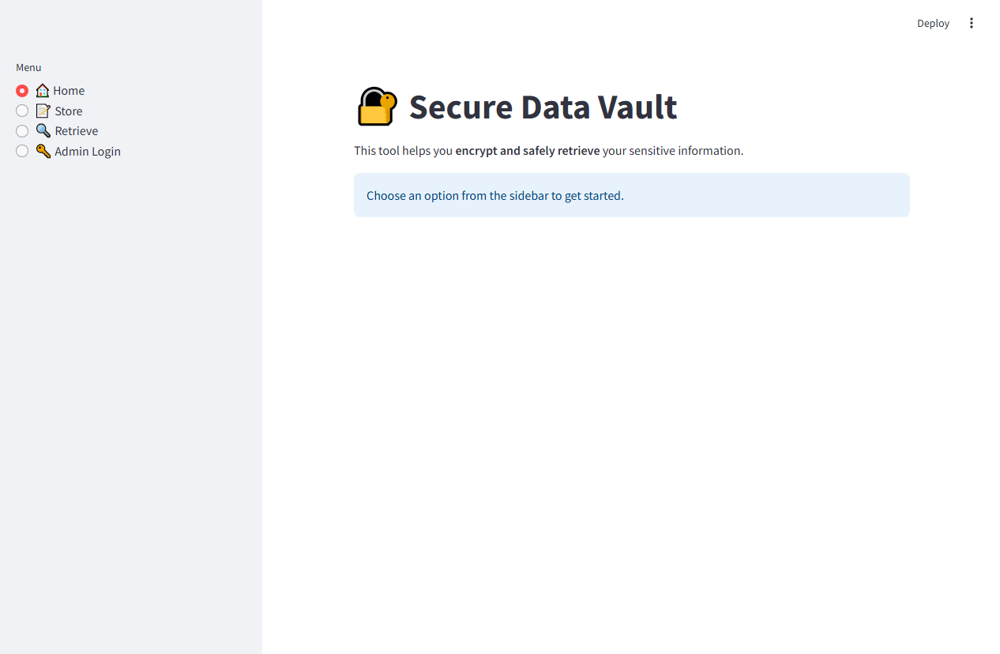
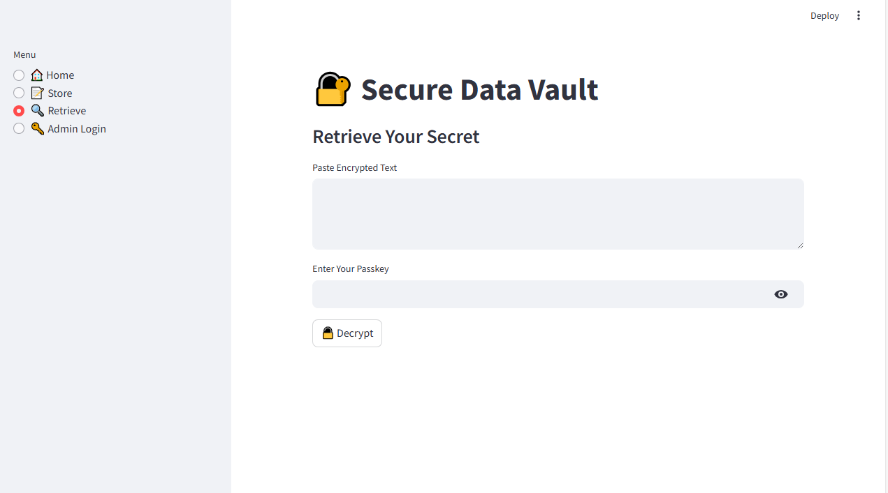

# 🔐 Secure Data Vault - Streamlit App

A simple and secure data encryption & decryption app built with **Python**, **Streamlit**, and **Fernet symmetric encryption**. This project allows users to store sensitive information securely and retrieve it using a passkey system.

---

## 📦 Features

- 🔑 **Symmetric Encryption** using Fernet (AES under the hood)
- 📝 **Data Storage** with hashed passkeys
- 🔍 **Data Retrieval** with passkey validation
- 🛡️ **Brute-force Protection** with limited attempts
- 🔓 **Admin Login** for reauthorization
- 🌐 **Streamlit UI** for clean, interactive experience

---

## 📸 Screenshots

| Home Page | Store Data | Retrieve Data | Admin Login |
|-----------|------------|---------------|-------------|
|  |  |  |  |

---

## 🚀 Getting Started

### Prerequisites

Make sure you have Python 3.8 or higher installed.

### Installation

```bash
git clone [https://github.com/SHAJAR5110](https://github.com/SHAJAR5110/Secure-Data-Encryption-System-Using-Streamlit
```

